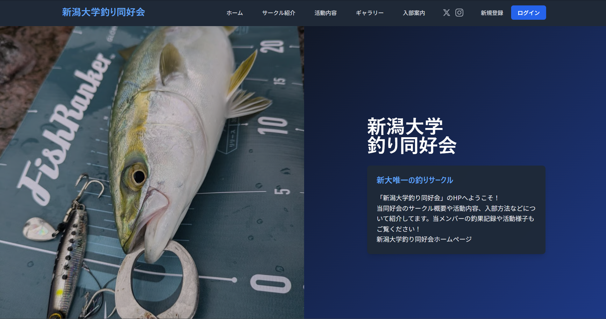

# 新潟大学釣り同好会web

環境構築手順はSETUP.mdを参照してください。

- セットアップ手順: [SETUP.md](SETUP.md)



## 制作背景

従来のサイトはノーコードツール（Jimdo）で運用していましたが、以下の課題がありました。

- 拡張性の限界 : 機能追加や権限設計の自由度が低い
- 情報の塩漬け : メンバーが持つ貴重な釣果情報がLINE等のチャットツール内に閉じ込められ、資産として蓄積・活用されていない
- 更新頻度の極端な低下 : サイトの更新が「年1回」程度に留まっていた。最新の活動状況が外部（新入生や協賛の方々）へ伝わらず、サークルが活発に見えない状態


この刷新の主目的は次の3点です。

- 釣果情報の適切な保護と公開制御 : 釣果情報を適切に保護し、公開範囲を制御できる基盤を作る
- 後輩へ引き継げる開発基盤 : 属人化を排除し、引継ぎしやすい環境構築をする
- 対外的な信頼性の向上 : 常に最新の活動が表示されることで、協賛企業様や外部パートナーに対しても「活動が継続的に行われている」という信頼の証を提供する


## 主要技術スタック

- **Backend** : Laravel 11, PHP 8.3+
- **Frontend** : Vue.js, Tailwind CSS, Vite
- **Database** : MySQL 8.0+
- **その他** : Docker, Docker Compose, Nginx

## ディレクトリ構成（ソースコード概要）

```
src/
├── app/                          # アプリケーションロジック
│   ├── Http/
│   │   ├── Controllers/          # コントローラー
│   │   ├── Middleware/           # ミドルウェア
│   └── Models/                   # データモデル（User, Group, UserGroup等）
├── database/
│   └──  migrations/               # スキーマ定義
├── lang/                         # 多言語対応（日本語・英語）
├── public/                       # 公開ディレクトリ（画像・ビルド出力）
├── resources/
│   ├── css/                      # Tailwind CSS
│   ├── js/                       # JavaScript
│   └── views/                    # Bladeテンプレート
├── routes/                       # ルート定義（Web, API等）
└── 設定ファイル
    ├── composer.json             # PHP依存管理
    ├── package.json              # Node.js依存管理

```

## 技術選定と意図

## 1. PHP / Laravel

2か月という短期間でも、認証・セッション管理・DB操作を実装するために採用しました。

- Laravel Breezeを使った標準的な認証導入
- マイグレーション中心の安全なDBスキーマ運用
- 将来的な機能追加を見据えたLaravelのMVCモデルに基づいた保守性の高い構成

## 2. Docker（WSL2 / Ubuntu想定）

Windows環境でもLinux前提の安定した開発環境を再現し、個人開発からチーム開発へ移行しやすくするために採用しました。

- ローカル差異を最小化
- セットアップ再現性の向上
- 新規メンバー参加時のオンボーディング簡略化

## 3. 4段階ACL（権限管理）

グループ運用で必要な承認フローと責務分離を実現するため、4段階の権限を実装しています。

- レベル1: 申請中
- レベル2: 一般メンバー
- レベル3: 幹部・管理者
- レベル4: オーナー

これにより、閲覧範囲・管理操作・所有者権限を明確に分離できます。


## 現在の進捗

実装済みの主要機能:

- ログイン・認証機能
- グループ管理機能
- 権限付与とアクセス制御

## Roadmap

今後の開発予定:

- Q&A機能
- ブログ機能
- クローズページからオープンページへのフロー
- オープンページのデザイン改正

## 開発者メッセージ

バックエンドほぼ未経験の状態から2か月で、実運用を見据えたセキュリティと基盤を構築しました。

このプロジェクトは単なるWebサイト移行ではなく、運用に耐える品質を担保しつつ、次世代のメンバーが改善を継続できる土台を作る取り組みです。

## ドキュメント案内

- 環境構築・デプロイ・トラブル対応: [SETUP.md](SETUP.md)
- セキュリティポリシー: [SECURITY.md](SECURITY.md)
